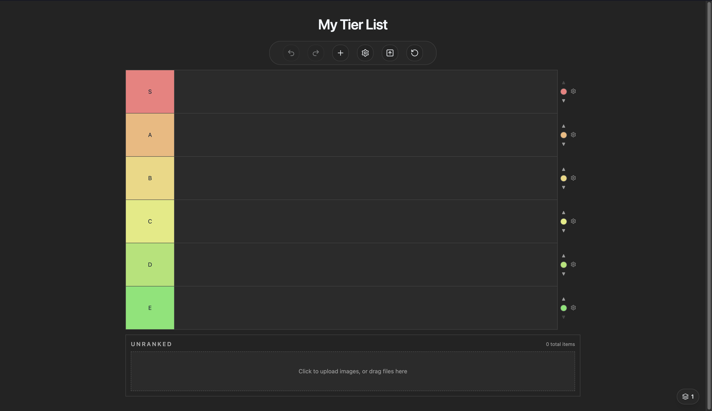

# tierlistbuilder

A fast, local-first tier list builder for the browser.



## Features

- **Drag-and-drop ranking** — sort items across S/A/B/C/D/E tiers with smooth drag preview
- **Image & text items** — upload images or create text-only items with colored backgrounds
- **Multi-board management** — create, switch, duplicate, rename, and delete independent boards
- **Export** — PNG, JPEG, WebP, PDF, or copy directly to clipboard
- **JSON import/export** — save and restore single or multi-board `.json` backups
- **Undo/redo** — full action history with Ctrl+Z / Ctrl+Shift+Z
- **Customizable display** — item sizes, shapes, label visibility, compact mode, tier label width
- **Drag-to-trash** — drag items to a trash zone or use hover-reveal delete buttons
- **Keyboard accessible** — browse & reorder items with arrow keys, Space to grab/drop
- **8 color themes & 5 text styles** — classic, midnight, forest, ember, sakura, AMOLED, high-contrast & classic-light themes w/ default, mono, serif, rounded & display typography

## Getting Started

Requires **Node 22**.

```sh
npm install
npm run dev
```

`npm run dev` starts a local Convex deployment and Vite together. Local Convex
state lives in `.convex/`; hosted production remains separate.

| Command                     | Description                   |
| --------------------------- | ----------------------------- |
| `npm run dev`               | Start local Convex + Vite     |
| `npm run dev:app`           | Start Vite only               |
| `npm run dev:cloud`         | Start cloud dev Convex + Vite |
| `npm run convex:auth:local` | Configure local Convex Auth   |
| `npm run build`             | Type-check & build            |
| `npm run lint`              | Lint with ESLint              |
| `npm run test`              | Run unit tests (Vitest)       |
| `npm run preview`           | Preview production build      |

## Stack

React 19 · TypeScript · Vite 7 · Tailwind CSS 4 · Zustand 5 · @dnd-kit · html-to-image · jsPDF · Vitest · Cloudflare Workers

## Docs

See [`docs/architecture.md`](docs/architecture.md) for architecture details.
