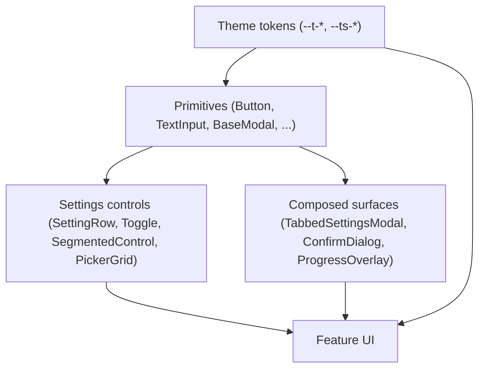
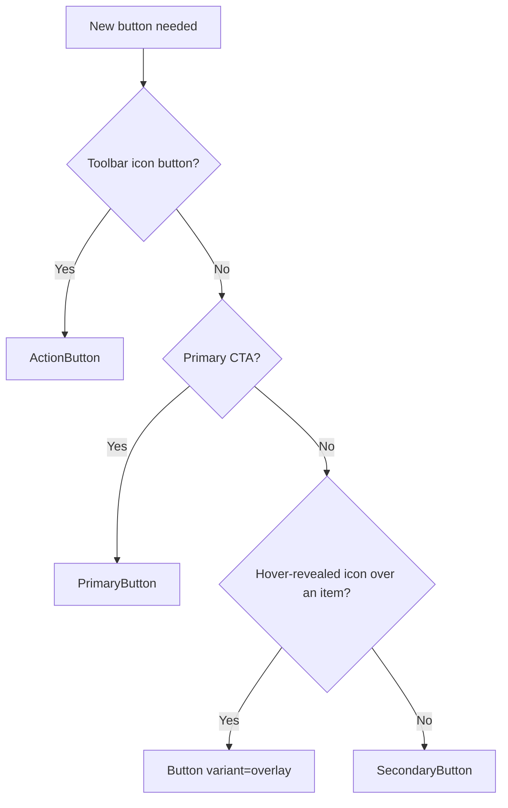
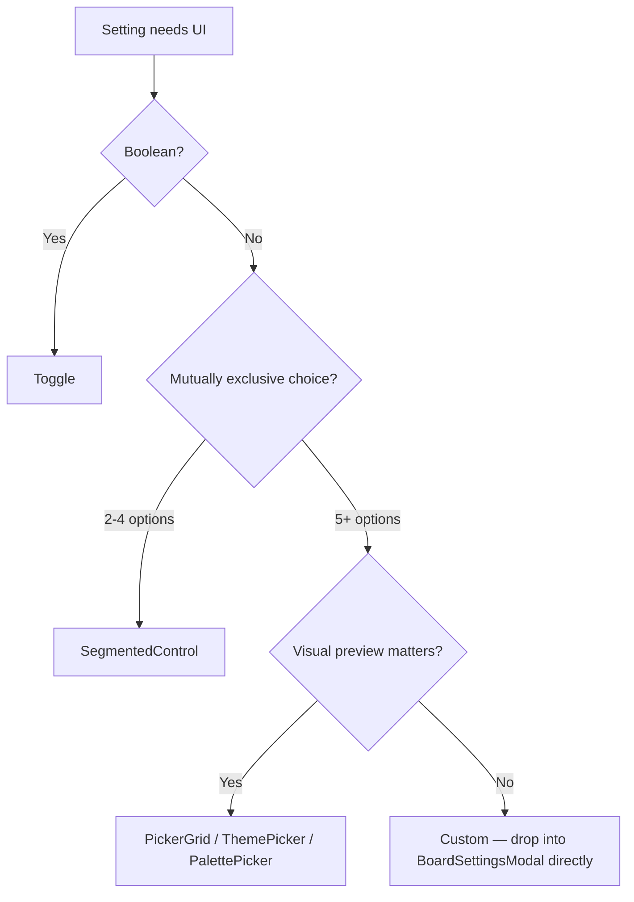
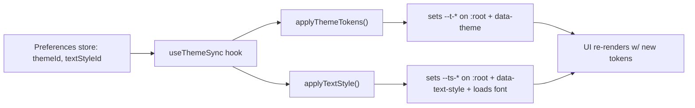

# Design System

This is a **decisions doc**. It answers questions like _"do I reach for `Button` or `PrimaryButton`?"_ and _"do I open a `BaseModal` or a `ConfirmDialog`?"_ — TypeScript types in `src/shared/ui/` and `src/shared/overlay/` are the source of truth for props.

> [!NOTE]
> Tokens, primitives, and overlay surfaces all live under `src/shared/`. `shared/*` never imports from `features/*`. New design-system additions go here, not into a feature slice.

The full color-theme spec (per-theme swatches, palette catalogs, accessibility rationale) lives in [`dev-docs/theming-system.mdx`](../dev-docs/theming-system.mdx) — this doc summarizes the runtime token contract and points there for design intent.

---

## How the layers fit

Three rules keep this stack honest:

1. **Tokens, never hex.** App chrome reads `var(--t-*)` / `var(--ts-*)`. Hardcoded colors are reserved for tier palettes, user-chosen item backgrounds, and the always-dark overlay exceptions called out below.
2. **Primitives, never raw `<button>` / `<input>` / portal.** If a primitive exists for the role, use it; if it doesn't, build one in `shared/ui/` or `shared/overlay/` rather than inlining chrome.
3. **One stacking rung at a time.** Use the existing Tailwind `z-*` rungs already established for dropdowns, overlays, and modals. Don't invent arbitrary values like `z-[27]`.

---

## Tokens

### Color tokens (`--t-*`)

Defined per theme in `src/shared/theme/tokens.ts`, written to `:root` by `applyThemeTokens()` in `src/shared/theme/runtime.ts`. There are **22 color tokens** grouped by role:

| Role        | Tokens                                                                                                                  |
| ----------- | ----------------------------------------------------------------------------------------------------------------------- |
| Backgrounds | `--t-bg-page`, `--t-bg-surface`, `--t-bg-sunken`, `--t-bg-overlay`, `--t-bg-drag-over`, `--t-bg-hover`, `--t-bg-active` |
| Borders     | `--t-border`, `--t-border-secondary`, `--t-border-hover`                                                                |
| Text        | `--t-text`, `--t-text-secondary`, `--t-text-muted`, `--t-text-faint`, `--t-text-dim`                                    |
| Accent      | `--t-accent`, `--t-accent-hover`, `--t-accent-foreground` (computed contrast)                                           |
| Destructive | `--t-destructive`, `--t-destructive-hover`, `--t-destructive-foreground` (computed contrast)                            |
| Success     | `--t-success`                                                                                                           |
| Mixing      | `--t-overlay` (space-separated RGB triplet for `rgb(var(--t-overlay)/0.12)` opacity tints)                              |
| Export      | `--t-export-bg`                                                                                                         |

> [!TIP]
> Use `rgb(var(--t-overlay)/<alpha>)` instead of stacking translucent layers when you want a hover/active wash that blends with whatever surface sits behind it. The triplet (`255 255 255` on dark themes, `0 0 0` on light) flips automatically.

#### When NOT to use color tokens

These are the only sanctioned exceptions:

:::warning Always-dark overlay exceptions

- **Modal backdrops** -> `bg-black/60`
- **Image/media overlays** (item overlay buttons, export-preview matte) -> `bg-black/50`, `bg-black/60`, `bg-black/70`
- **Annotation workspace matte** -> `bg-black/30`
- **Black drop shadows** -> `shadow-black/*`
  :::

:::info User-chosen colors
Tier-color palettes (`shared/theme/palettes.ts`), user-picked item backgrounds, and theme definition tables themselves use raw hex values. These are **data**, not chrome.
:::

### Typography tokens (`--ts-*`)

Defined in `src/shared/theme/textStyles.ts`. Five text styles ship: `default`, `mono`, `serif`, `rounded`, `display`. Each writes four properties:

| Token                 | Role                             |
| --------------------- | -------------------------------- |
| `--ts-font-family`    | Font family stack                |
| `--ts-weight-normal`  | Body weight                      |
| `--ts-weight-heading` | Heading/emphasis weight          |
| `--ts-letter-spacing` | Global letter-spacing adjustment |

`useThemeSync` (`features/platform/preferences/model/useThemeSync.ts`) syncs the active style to `:root`. Non-system fonts are loaded dynamically from Google Fonts by `applyTextStyle()` — keep new styles offline-capable by listing system fallbacks first.

## Buttons

One unified primitive (`shared/ui/Button.tsx`) covers four variants. Named wrappers exist for the common cases so call sites stay semantic.

| Pick              | When                                                            | Where                           |
| ----------------- | --------------------------------------------------------------- | ------------------------------- |
| `PrimaryButton`   | Submit/confirm action — modal CTA, save, publish                | `shared/ui/PrimaryButton.tsx`   |
| `SecondaryButton` | Cancel, dismiss, dialog secondary action, settings rows         | `shared/ui/SecondaryButton.tsx` |
| `ActionButton`    | Circular icon button in a toolbar — must take `label` + `title` | `shared/ui/ActionButton.tsx`    |
| `Button` (raw)    | You need a variant the wrappers don't expose (e.g. `overlay`)   | `shared/ui/Button.tsx`          |

### Decision guide

### Tones & sizes

- **Tones** — `accent` (default for primary), `destructive`, `neutral`/`default`, `success` (overlay-only). The named wrappers narrow `tone` to the relevant subset; reach for raw `Button` if you need something else.
- **Surface** — `SecondaryButton` accepts `variant="surface" | "outline"`. Use `surface` when the button sits on `--t-bg-page` and needs a filled background; `outline` when it sits on a panel.
- **Sizes** — `xs`, `sm`, `md`. `PrimaryButton` defaults to `sm`; `SecondaryButton` defaults to `md`. Don't override unless the surface demands it.

> [!TIP]
> All button variants share `BUTTON_FOCUS_CLASS` and `BUTTON_DISABLED_CLASS` from `buttonBase.ts` — focus rings and disabled chrome are consistent without you doing anything. The `overlay` variant intentionally opts out of `disabled` because overlay actions are either rendered or hidden, never disabled.

### Anti-patterns

:::danger Don't

- **Don't** roll your own `<button>` chrome — it will drift from focus-ring & disabled defaults.
- **Don't** use `PrimaryButton` for both confirm and cancel in the same dialog. Pair `PrimaryButton` (CTA) with `SecondaryButton` (cancel).
- **Don't** put `tone="destructive"` on a button that doesn't actually destroy data. Reserve red for actions a user would want to undo.
  :::

---

## Form & input primitives

| Pick             | When                                                      | Where                          |
| ---------------- | --------------------------------------------------------- | ------------------------------ |
| `TextInput`      | Single-line text — board title, item label, modal field   | `shared/ui/TextInput.tsx`      |
| `TextArea`       | Multi-line text — paste-many imports, descriptions        | `shared/ui/TextArea.tsx`       |
| `ColorInput`     | Native `<input type="color">` swatch                      | `shared/ui/ColorInput.tsx`     |
| `UploadDropzone` | Image drop target — settings panel & unranked empty state | `shared/ui/UploadDropzone.tsx` |

`TextInput` and `TextArea` share two variants:

- `variant="surface"` — bordered, themed background. Default.
- `variant="ghost"` — transparent background, no border. Use for inline-edit fields layered on top of a parent surface (e.g. board title editor).

Sizes (`xs`, `sm`, `md`) match the button scale, so a `TextInput size="sm"` next to a `SecondaryButton size="md"` will line up vertically without padding hacks.

---

## Settings & picker controls

Live under `src/shared/ui/settings/` and consumed primarily by `BoardSettingsModal` and `PreferencesModal`. They compose into rows so a settings tab reads as a vertical list.

| Component             | Role                                                                           |
| --------------------- | ------------------------------------------------------------------------------ |
| `SettingsSection`     | Titled rounded panel — wraps a group of related rows                           |
| `SettingRow`          | Label + control row, with optional helper text                                 |
| `Toggle`              | Boolean on/off — bound to `aria-checked`                                       |
| `SegmentedControl`    | Mutually exclusive choice — 2-4 options, all visible at once                   |
| `PickerGrid`          | 5+ visual options w/ roving keyboard nav (themes, palettes)                    |
| `ThemePicker`         | `PickerGrid` specialization for theme tokens                                   |
| `PalettePicker`       | `PickerGrid` specialization for tier palettes                                  |
| `TextStylePicker`     | `PickerGrid` specialization for text styles                                    |
| `TabbedSettingsModal` | Modal shell w/ tab strip + active panel — used by board settings & preferences |

### When to reach for which control

> [!TIP]
> `PickerGrid` already wires `useRovingSelection` for arrow-key navigation and accessible labelling. Don't reimplement keyboard handling on a custom grid — extend `PickerGrid` or accept that you've stepped outside the design system.

---

## Overlay system

`src/shared/overlay/` is split into three concerns: **dialog surfaces**, **modal behavior**, and **popup/menu behavior**. The split exists so you can compose a popup (anchored, dismissible, no focus trap) without dragging in modal-only behavior, and vice versa.

### Dialog surface picker

| Pick                  | When                                                                      | Where                                |
| --------------------- | ------------------------------------------------------------------------- | ------------------------------------ |
| `ConfirmDialog`       | Destructive or accent confirmation w/ a yes/no                            | `shared/overlay/ConfirmDialog.tsx`   |
| `ProgressOverlay`     | Long-running blocking task w/ N-of-M progress                             | `shared/overlay/ProgressOverlay.tsx` |
| `TabbedSettingsModal` | Multi-tab settings panel                                                  | `shared/ui/TabbedSettingsModal.tsx`  |
| `BaseModal`           | Anything else — custom-shaped dialog, compose your own header/body/footer | `shared/overlay/BaseModal.tsx`       |
| `LazyModalSlot`       | Wrap a modal you want to lazy-load via `React.lazy`                       | `shared/overlay/LazyModalSlot.tsx`   |

> [!IMPORTANT]
> Always prefer `ConfirmDialog` over hand-rolled `BaseModal` for yes/no flows — it bakes in destructive vs. accent variants, focus order, and Escape behavior. If you find yourself reimplementing those, you've probably reached for the wrong primitive.

### Modal behavior building blocks

`BaseModal` already wires these — you only call them directly if you're building a new dialog primitive:

| Module           | Role                                                                                |
| ---------------- | ----------------------------------------------------------------------------------- |
| `modalDialog.ts` | `useModalDialog()` — composes focus trap + inert background + Escape into one hook  |
| `focusTrap.ts`   | Focus containment for the topmost dialog                                            |
| `modalLayer.ts`  | Active-modal registry, app-shell `inert`, scroll lock w/ `scrollbar-gutter: stable` |
| `progress.ts`    | `resolveProgressOverlayState()` — pure progress-string formatter                    |

### Popup & menu building blocks

Used by `ColorPicker`, `TierRowSettingsMenu`, `BoardManager`, `ExportMenu`, `ItemEditPopover`, etc.

| Module                | Role                                                                         |
| --------------------- | ---------------------------------------------------------------------------- |
| `dismissibleLayer.ts` | Outside-interaction & Escape dismissal — does **not** trap focus             |
| `anchoredPopup.ts`    | Fixed-position popup tied to a trigger element                               |
| `popupPosition.ts`    | Pure positioning math — viewport flipping, gap constants                     |
| `uiMeasurements.ts`   | Shared px constants for popup gaps & menu heights                            |
| `menuOverflow.ts`     | Submenu offset class tokens + viewport-aware flip-left/flip-right hook       |
| `nestedMenus.ts`      | Pure nested-menu state machine + React hook wrapper                          |
| `OverlaySurface.tsx`  | `OverlayMenuSurface`, `OverlayPanelSurface`, etc. — themed chrome for popups |

> [!CAUTION]
> Popups and modals are **not** interchangeable. Modals trap focus, set `inert` on the app shell, and lock scroll. Popups dismiss on outside click, don't trap focus, and don't lock scroll. If you're not sure which you want, you probably want a modal.

### Modal stack & lazy modals

The keyed modal stack lives in `app/shells/useModalStack.ts` (a feature-shell concern, not `shared/`). Each shell owns its own modal payload map (`workspaceModals.ts`, etc.) and renders modals through `LazyModalSlot` so they don't ship in the initial bundle.

---

## Theming runtime

- **Per-board overrides.** `WorkspaceShell` layers board-specific theme/text-style overrides through `useBoardThemeOverrides()` so a single board can render in a different theme without touching the global preference.
- **Locked themes (embed).** `EmbedShell` calls `useLockedTheme('classic', 'default')` so embed iframes render a stable theme regardless of the host's preference. Use this pattern any time you need theme-stable output (export rendering already uses an isolated host).
- **Adding a theme.** New theme -> add an entry to `THEMES` in `src/shared/theme/tokens.ts`, extend `ThemeId` in `packages/contracts/lib/theme.ts`, ship a swatch row in `dev-docs/theming-system.mdx`. Computed contrast tokens (`--t-accent-foreground`, `--t-destructive-foreground`) are derived in `runtime.ts`; you don't list them per theme.

> [!NOTE]
> `data-theme` and `data-text-style` attributes on `<html>` exist so CSS selectors can do theme-conditional styling without a JS branch. Prefer token swaps over `[data-theme="x"]` selectors — but the latter is the right escape hatch for one-off rules that genuinely depend on the active theme.

---

## Composing safely — boundary rules

These mirror [`docs/architecture.md`](architecture.md#boundary-rules) but called out here because they bite when you're building UI:

- **`shared/*` never imports from `features/*`.** If a primitive needs feature-specific state, the feature passes it in as a prop.
- **No barrels.** Import from the file that defines the thing: `import { PrimaryButton } from '~/shared/ui/PrimaryButton'`, not from `~/shared/ui`.
- **UI -> model -> data.** A primitive doesn't read a Zustand store directly. The feature shell does, and hands the values down.
- **Embed shell renders through `shared/board-ui/*` only.** New primitives that the embed surface uses must be theme-locked-safe (no preference store reads).

---

## Adding to the design system

The bar for promoting a one-off into `shared/ui/` is:

1. **At least 2 call sites today.** No "we'll need it later" primitives.
2. **No feature-specific props.** A `WorkspacePublishButton` is a feature component; a `Button variant="primary" tone="accent"` is a design-system primitive.
3. **Tokenized.** Hardcoded hex values disqualify it — fix the chrome first, promote second.
4. **Keyboard-accessible by default.** Roving focus, `aria-*` plumbing, and Escape behavior baked in — not left as "the caller's problem".

Updates to this doc happen in the same PR as the primitive change, alongside any AGENTS.md style-conventions edits if a token name moves.

---

## Reference index

| Topic              | Source                                                                                                                |
| ------------------ | --------------------------------------------------------------------------------------------------------------------- |
| Color tokens       | `src/shared/theme/tokens.ts`                                                                                          |
| Tier palettes      | `src/shared/theme/palettes.ts`                                                                                        |
| Text styles        | `src/shared/theme/textStyles.ts`                                                                                      |
| Theme runtime      | `src/shared/theme/runtime.ts`                                                                                         |
| Tier color helpers | `src/shared/theme/tierColors.ts`                                                                                      |
| Button primitive   | `src/shared/ui/Button.tsx`, `buttonBase.ts`                                                                           |
| Form inputs        | `src/shared/ui/TextInput.tsx`, `TextArea.tsx`, `ColorInput.tsx`, `UploadDropzone.tsx`                                 |
| Settings controls  | `src/shared/ui/settings/`, `SettingsSection.tsx`, `TabbedSettingsModal.tsx`, `PickerGrid.tsx`                         |
| Overlay surfaces   | `src/shared/overlay/BaseModal.tsx`, `ConfirmDialog.tsx`, `ProgressOverlay.tsx`, `OverlaySurface.tsx`                  |
| Modal behavior     | `src/shared/overlay/modalDialog.ts`, `focusTrap.ts`, `modalLayer.ts`                                                  |
| Popup behavior     | `src/shared/overlay/anchoredPopup.ts`, `dismissibleLayer.ts`, `popupPosition.ts`, `menuOverflow.ts`, `nestedMenus.ts` |
| Theme spec (long)  | [`dev-docs/theming-system.mdx`](../dev-docs/theming-system.mdx)                                                       |
| Style conventions  | [`AGENTS.md` § Style conventions](../AGENTS.md#style-conventions)                                                     |
